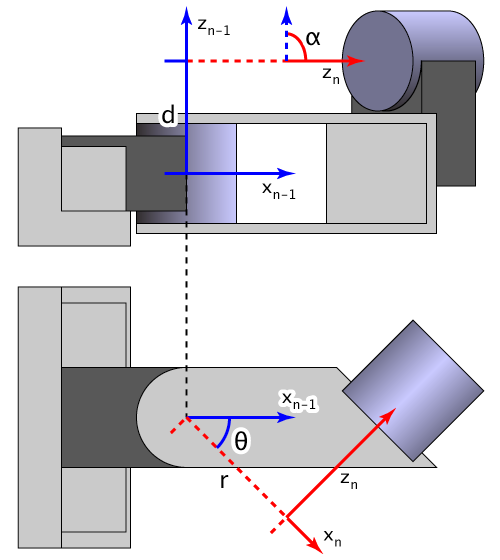

Denavit-Hartemberg parameters are used to attach reference frames to the joints of a spatial kinematic chain.

This Calculator aims to be a online tool for calculating the transformation matrices of these joints and the complete transformation matrix over all joints.

The Parameters used are according to the standard Denavit-Hartemberg convention. These Parameters are: 
- Joint angle Theta θi: Rotational angle between the xi-1 axis and the  xi axis.
- Distance di: Distance from the origin of i-1 to the intsection of the zi-1 axis  with the xi axis along the zi-1 axis.
- Armlength ai: Distance from the intersection of zi-1 axis with the xi to the origin of the ith coordinate system along the xi axis.
- Armtorsion αi: Angle between the zi-1 and the zi axis

Example from Wikipedia:

